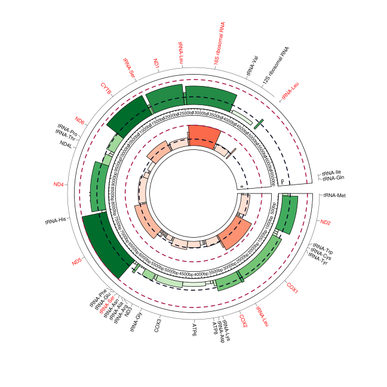

### NUMTS analysis

Based on the work of: https://github.com/WeiWei060512/NUMTs-detection
Wei W, Schon K, Elgar G, Orioli A, Tanguy M, Giess A, Tischkowitz M, Caulfield M, Chinnery PF. Nuclear-embedded mitochondrial DNA sequences in 66,083 human genomes. Nature 611, 105–114 (2022). https://doi.org/10.1038/s41586-022-05288-7

## Consists of: 
	* **Analysis  
	* **Methods

	To detect NUMTs, we used the aligned WGS BAM files and and extracted the discordant read pairs using samblaster and samtools and included the read pairs where one end aligns to nuclear genome and the other end aligns to the mtDNA reference sequence. The reads with mapping quality higher than 0 were used. The discordant reads were then clustered together based on sharing the same orientation and whether they were within a distance of 500 bp. We detected the clusters supported by at least two pairs of discordant reads. The NUMTs within a distance of 500bp on both nuclear DNA and mtDNA were grouped as the same NUMT. We found the NUMTs supported by at least two pairs of discordant reads. 
	

	* **Data extraction  
	* **Visualization  
		* Plots  
		* Circos  

